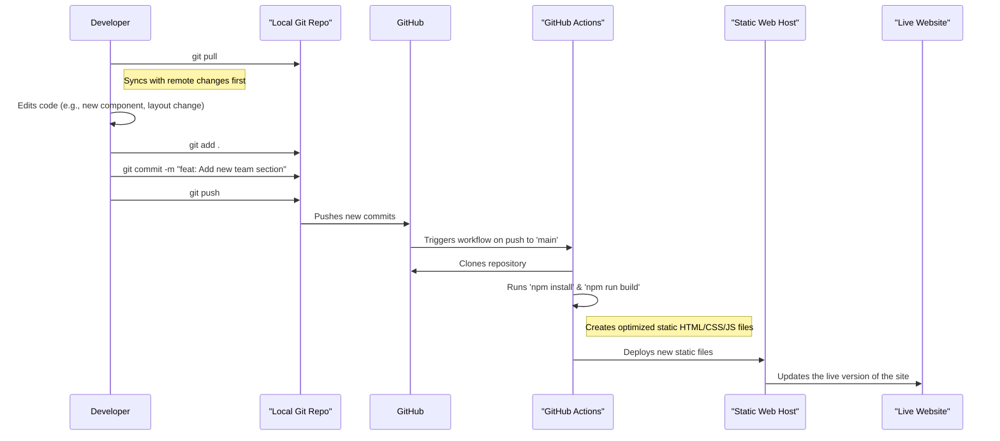

# Code Development Workflow

This sequence diagram shows the workflow for a developer pushing code changes to the site.

```mermaid
sequenceDiagram
    participant Developer
    participant LocalRepo as "Local Git Repo"
    participant GitHub
    participant CI_CD as "GitHub Actions"
    participant Host as "Static Web Host"
    participant LiveSite as "Live Website"

    Developer->>LocalRepo: git pull
    note right of Developer: Syncs with remote changes first

    Developer->>Developer: Edits code (e.g., new component, layout change)
    Developer->>LocalRepo: git add .
    Developer->>LocalRepo: git commit -m "feat: Add new team section"
    Developer->>LocalRepo: git push

    LocalRepo->>GitHub: Pushes new commits

    GitHub->>CI_CD: Triggers workflow on push to 'main'
    CI_CD->>GitHub: Clones repository
    CI_CD->>CI_CD: Runs 'npm install' & 'npm run build'
    note right of CI_CD: Creates optimized static HTML/CSS/JS files

    CI_CD->>Host: Deploys new static files
    Host->>LiveSite: Updates the live version of the site
```
