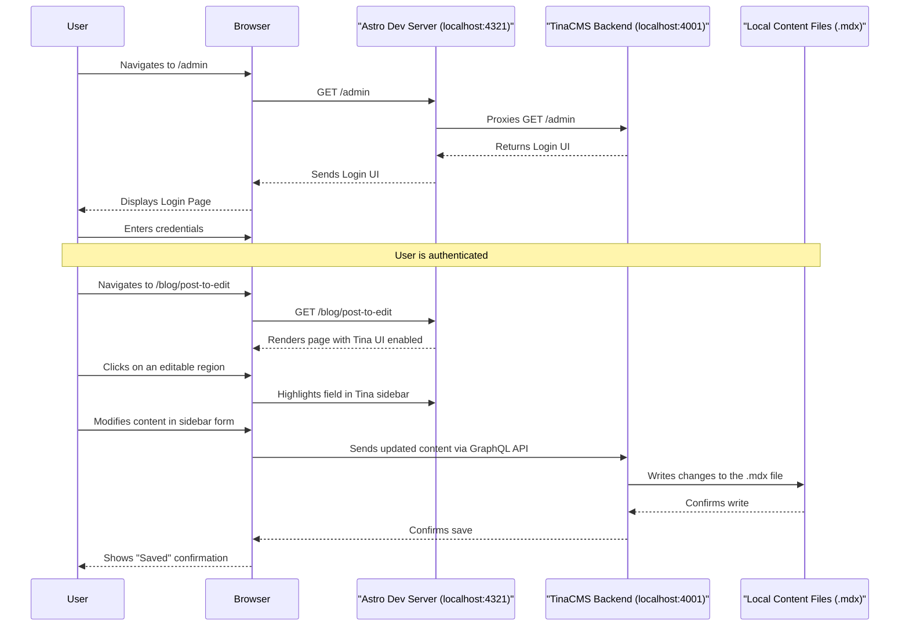

# Content Editing Workflow

This sequence diagram illustrates the step-by-step process for a non-technical user editing content on the site.

```mermaid
sequenceDiagram
    participant User
    participant Browser
    participant AstroServer as "Astro Dev Server (localhost:4321)"
    participant TinaServer as "TinaCMS Backend (localhost:4001)"
    participant Files as "Local Content Files (.mdx)"

    User->>Browser: Navigates to /admin
    Browser->>AstroServer: GET /admin
    AstroServer->>TinaServer: Proxies GET /admin
    TinaServer-->>AstroServer: Returns Login UI
    AstroServer-->>Browser: Sends Login UI
    Browser-->>User: Displays Login Page

    User->>Browser: Enters credentials
    Note over User, Files: User is authenticated

    User->>Browser: Navigates to /blog/post-to-edit
    Browser->>AstroServer: GET /blog/post-to-edit
    AstroServer-->>Browser: Renders page with Tina UI enabled

    User->>Browser: Clicks on an editable region
    Browser->>AstroServer: Highlights field in Tina sidebar
    User->>Browser: Modifies content in sidebar form
    Browser->>TinaServer: Sends updated content via GraphQL API
    TinaServer->>Files: Writes changes to the .mdx file
    Files-->>TinaServer: Confirms write
    TinaServer-->>Browser: Confirms save
    Browser-->>User: Shows "Saved" confirmation
```
